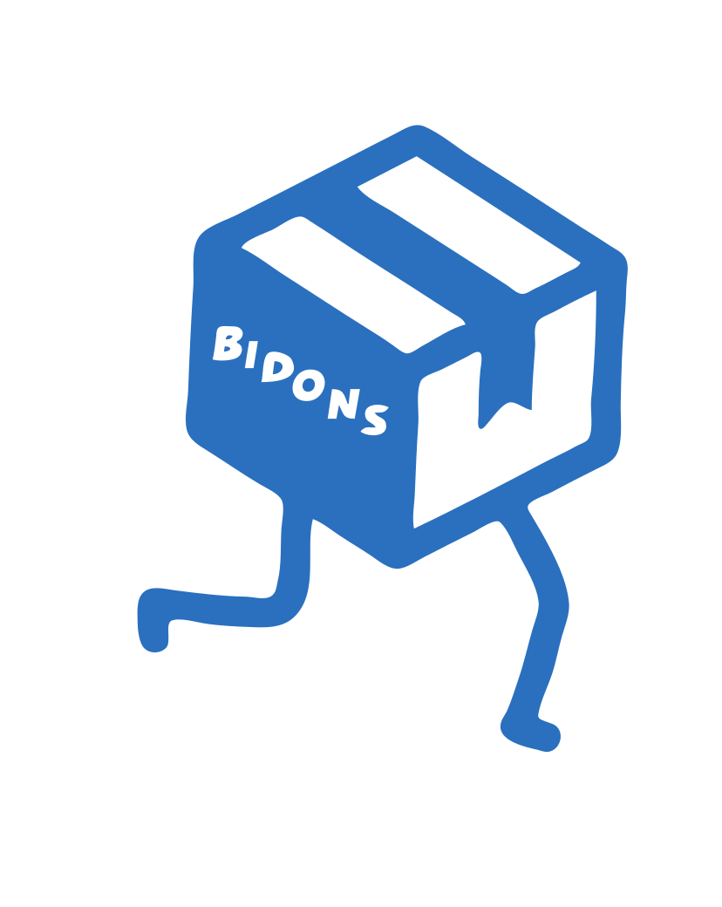

# Progetto-F24 : Traslochi System
## Progetto Gruppo: Bidons

 
Scegli Bidons per il tuo trasloco: un'azienda giovane e dinamica  conosciuta sul territorio per l’attenzione al cliente e la competenza professionale. Nata a Pavia nel 2023, l’azienda lavora in modo trasparente flessibile, così da poter offrire un servizio impeccabile a prezzo vantaggioso.

## Obiettivo:

Il sistema è stato progettato per soddisfare una piccola azienda di traslochi ed offre un servizio 
di prenotazione per i clienti , mentre per il responsabile e dipendenti  il sw puo essere puo essere usato per la gestione aziendale.  
Ha svariate funzionalità quali:   
* La creazione del proprio profilo all'interno del sistema
* Prenota un servizio di Traloschi
* Visualizza e modifica il proprio profilo
* Il Responsabile consulta i dipendenti presenti e le prenotazioni presenti,assegna e rimuove turni
 
## Dipendenze:

Per funzionare il software richiede la presenza delle seguenti librerie
- [JUnit 4](https://github.com/junit-team/junit4/releases/tag/r4.13.2)
- [MySQL java connector](https://github.com/mysql/mysql-connector-j) 
 
